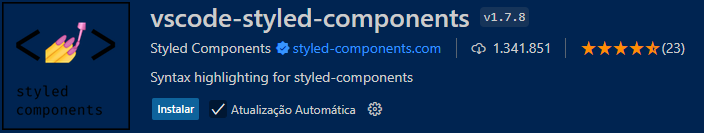
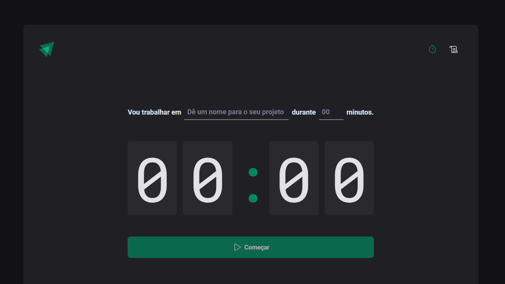
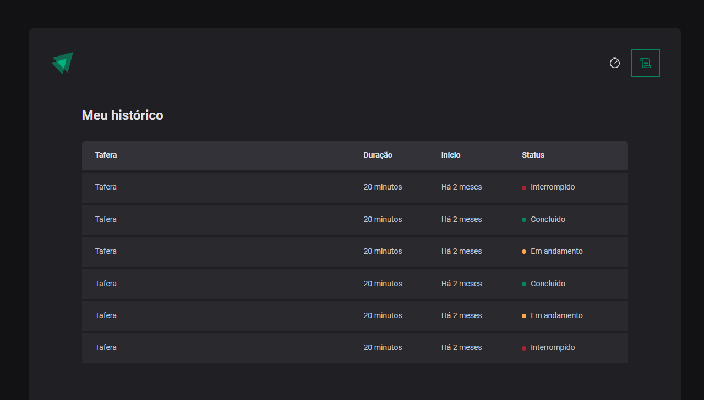

<a href="Readme-pt.md" style="color:#B0E0E6;">Portuguese</a>

# Project Deliverable - Building a Timer with React | Rocketseat

 This project is a fully functional Timer application built using React. The main goal of this project is to demonstrate how to effectively build components and organize your React project using the tools and features provided by the Vite framework.

## Technologies Used 

- TYPE SCRIPT
- REACT 
- CSS 
- HTML 

## How to Run the Project 

1. Clone the repository: 

   ```bash 
   git clone https://github.com/Miguelalmeida01/ProjetoTimer-CursoRocketseat-.git 
   ``` 
2. Navigate to the project directory: 

   ```bash 
   cd Timer
   ``` 

3. Install the dependencies: 

   ```bash 
   npm i 
   ``` 

4. Download the styled-components library: 

   ```bash 
   npm i styled-components 
   ``` 

5. Download the types library: 

   ```bash 
   npm i @types/styled-components -D 
   ``` 

6. It is important to have the vscode-styled-components extension:

   


7. Access the project in the browser: 

   ```bash
   npm run dev 
   ``` 
   
8. Design in Figma:

   ```bash
   https://www.figma.com/design/zjvY9inly7CJVJLwe9G2kV/Ignite-Timer-%E2%80%A2-Projeto-React?node-id=0-1&t=Hd8siT3udcNs4jDm-0
   ``` 

 ## Web project 
 
  

  
 
<a href="https://github.com/Miguelalmeida01/ProjetoTimer-CursoRocketseat-?tab=readme-ov-file#project-delivery---creating-a-landing-page-with-react--rocketseat" style="color:#B0E0E6;" >
Back</a> 